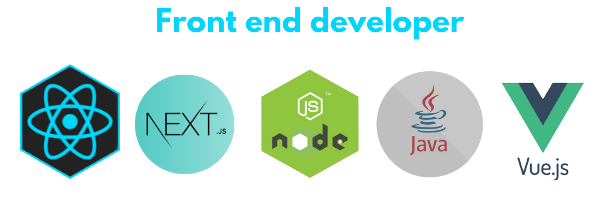

<h2>Hi there, I'm Guilherme Coelho</h2>

 

 

 
 

#### I'm a future full stack web developer, I've loved coding since my high school, I'm probably coding right now.  Looking for my first job as a junior front end developer.

   

## Educational background 📒

 

* Computer Science Student at São Judas Tadeu
* Front end developer by Alura & Rocketseat

      

<h2 align="center">Best projects</h2>

 

   

<h2 align="center">" Whatever is done for love always occurs beyond good and evil "</h2>
<h3 align="center">Friedrich Nietzsche</h3>

  

 

