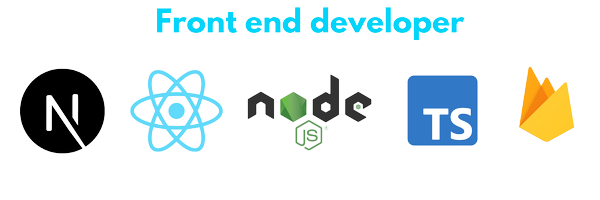
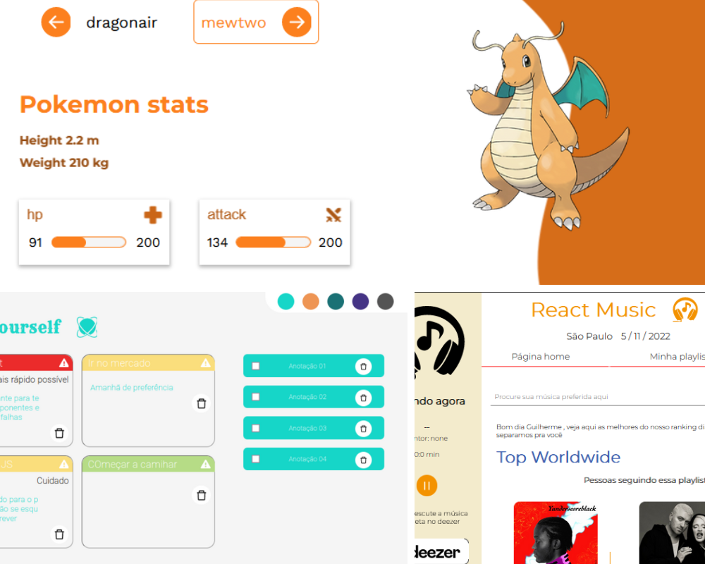

<h2>Hi there, I'm Guilherme Coelho</h2>

 

 

<a href="mailto:gs.coelho_dev@outlook.com" target="_blank" align="center">

</a>

 
 

## I'm Full stack web developer

- ### I've coding since my high school and I love building functionality and apps with reactjs and nodejs ecosystem.
- ### I currently work in an education company creating ERP functionalities and building new applications that help in the daily lives of several children.
- ### Work on <a href="https://www.instagram.com/escolavereda/" target="_blank">Vereda Educação S.A</a>

 

  

 

## Educational background 📒

 

- Computer Science Student at São Judas Tadeu (4º period)
- Front end developer by Alura & Rocketseat

 

## Goals in my carreer 🚀

 

- Work as a mid-level react front end developer
- Work for foreign companies

 

 

  

 

<h2 align="center">Best projects</h2>

 

 
<h2 align="center"> React Ecosystem ⚛</h2>️

| frameworks | style-system      | state-managment | Others        |
| ---------- | ----------------- | --------------- | ------------- |
| React JS   | Material UI       | React Query     | Vitest        |
| Next       | Styled components | Jotai           | Framer motion |
| Node       | Prime react       | Context API     |               |
| Firebase   | Radix             | Redux           |               |

 

 

 
